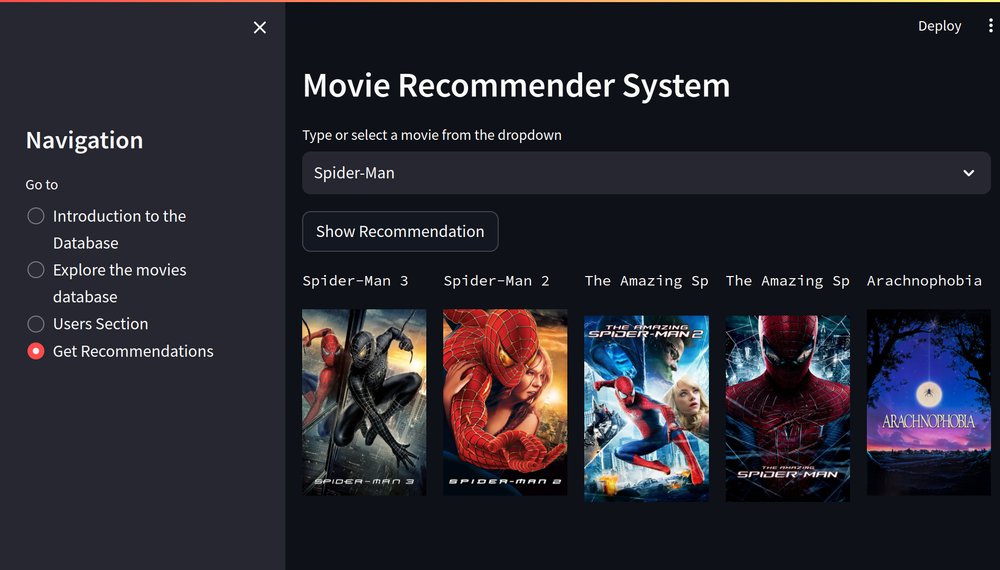
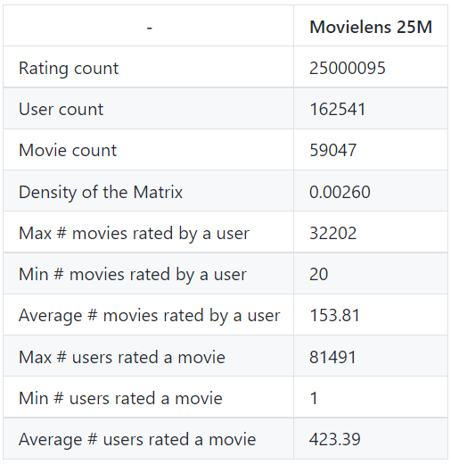
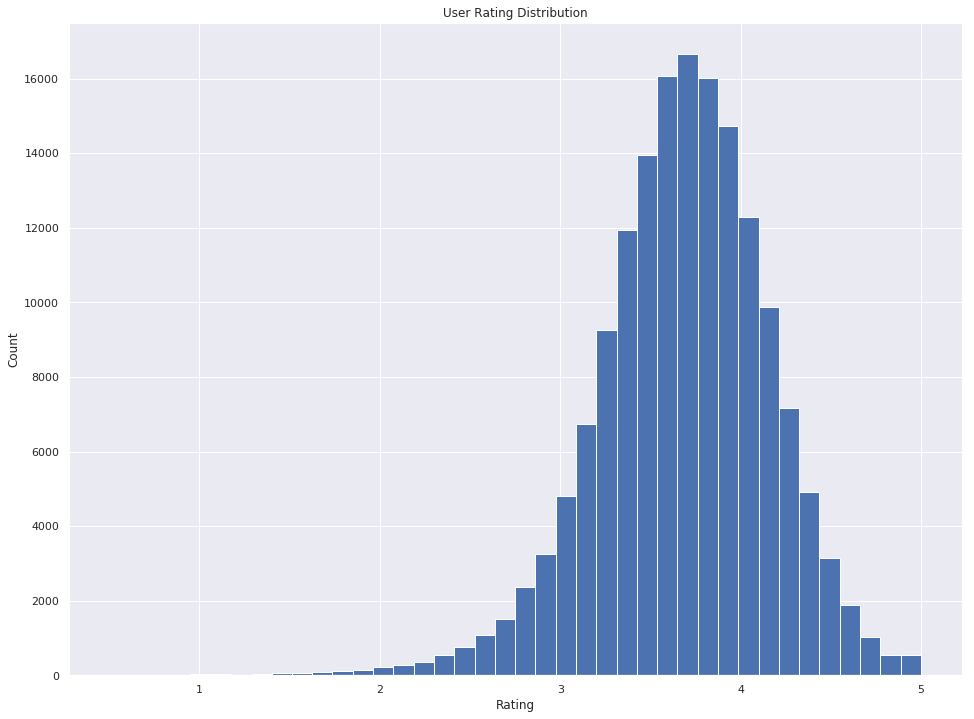
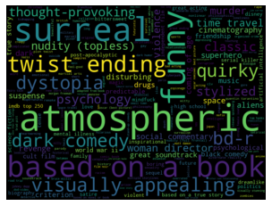

# Awesome-Movie-Database-and-Recommender-System

Through this Project we attempt to create a Movie Database and Recommendation System. 
The recommendation section = page 4 - content based movie recommender system using cosine similarity.
The user can perform the following operations within milliseconds response time:

* Search for a movie by its title or part and get similar recommendations
* View Top rated movies, Genre Wise
* Find users in the database with similar taste of movies
* Recommend movies to a given user from the database
* Get recommendations based on your choice of movies

## Dataset Used - Movielens ratings 25 million rows (https://grouplens.org/datasets/movielens/25m/)
Here we have 25 million ratings and one million tag applications applied to 62,000 movies by 162,000 users.
List of Genres:
Action,Adventure,Animation,Children's,Comedy,Crime,Documentary,Drama,Fantasy,Film-Noir,Horror,Musical,Mystery,Romance,Sci-Fi,Thriller,War,Western

### Dataset Information :

#### Interesting facts - 

#### From prelimnary analysis, it was found that there is a person on this Earth, that watched 32202 movies and rated them on the Movielens platform. That  would probably take around 6-7 years. Hats Off T_T .

#### The movie rated most has over 80k ratings and that movie is Forrest Gump.

#### The ratings are distributed as follows:

## A word cloud created from the user's tags :

# Database Creation : 

## SQLAlchemy with SQLite
### SQLAlchemy offers several benefits over the raw SQL approach, including:

#### Cleaner code: 
                Having SQL code as Python strings gets messy pretty quickly.
#### More secure code: 
                Using SQLAlchemy's ORM functionalities can help mitigate against vulnerabilities such as SQL injection
#### Simpler logic:  
                SQLAlchemy allows us to abstract all of our database logic into Python objects. 
                Instead of having to think on a table, row, and column level, 
                we can consider everything on a class, instance, and attribute level.

# SQLAlchemy at three different layers of abstraction. 

**The lowest layer** is using only SQLAlchemy's engine component to execute raw SQL. 

**The middle layer** is using SQLAlchemy's expression language to build SQL statements in a more Pythonic way than using raw SQL strings. 

**The highest extraction layer** is using SQLAlchemy's full Object Relational Mapping (ORM) capabilities which allows one to think in terms of Python classes and objects instead of database tables and connections.

# Why SQLite?

##  It offers a full-featured relational database management system (RDBMS) that works with a single file to maintain all the database functionality.

##  It also has the advantage of not requiring a separate database server to function. The database file format is cross-platform and accessible to any programming language that supports SQLite.

# How to run the project ?
#### install packages listed in requirements.txt
#### download the movielens 25m dataset and extract the files in the movielens folder in the root directory.
#### run the files listed in data_preprocessing, it will generate all the necessary files to run the system.
#### in the terminal run command - streamlit run main_page.py

### Do let me know incase you face any issues in running the code - [contact me](https://docs.google.com/forms/d/e/1FAIpQLSffnCNYU70a0PRoXPvfOfCtyL5v64Jw5736fvKxjiLSHqPEjA/viewform)

Regards
Hrithik
